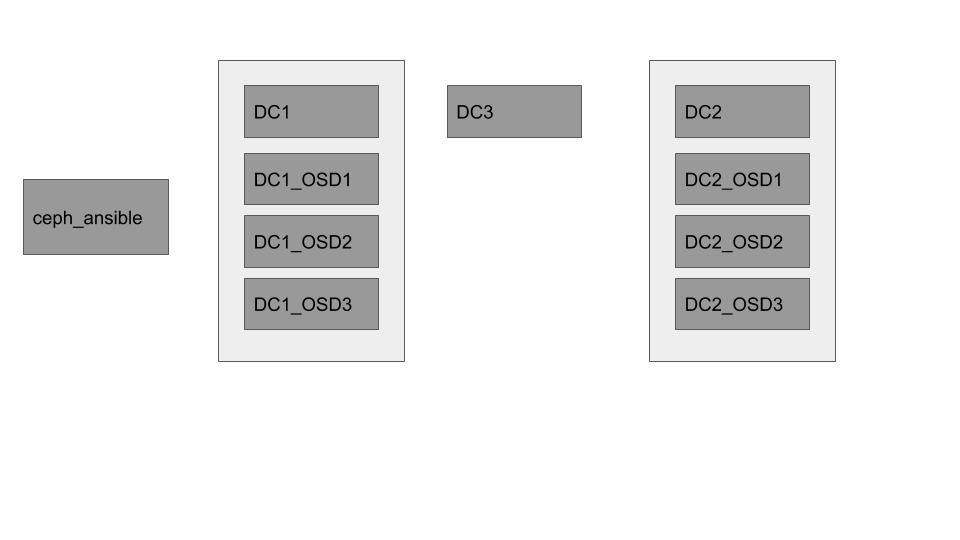

# Multi Site Ceph and Red Hat AMQ Broker

This contains a set of files explaining on how you can configure ceph-fs as a multi-site provider for ActiveMQ Artemis.

You will need a valid Red Hat subscription for Red Hat Ceph Storage to use these examples.

As a first step, you can use KVM to provide you the set of instances you need, and we have a scripts here that will help you define these instances.

If you decide to provide the instances directly, you can skip the step of creating these images and move directly to the ceph-ansible part.


# Instances required

You will need to define these following machines to use the examples provided here:

- <b>ceph-ansible</b>: This is an instance used to install packages on the other instances through ansible. In case you are using the kvm scripts provided here this instances will also be cloned as the other instances.

- <b>DC1</b>: This instance will be used for MONS, MDDS and MRGS services from ceph, equivalent to a instance located on Data center 1

- <b>DC2</b>: This instance will be used for MONS, MDDS and MRGS services from ceph, equivalent to a instance located on Data center 2

- <b>DC3</b>: This instance will be used for MONS, MDDS and MRGS services from ceph, equivalent to a instance located on Data center 3

- <b>DC1_OSD1</b>: An OSD instance for Data center 1

- <b>DC1_OSD2</b>: An OSD instance for Data center 1

- <b>DC1_OSD3</b>: An OSD instance for Data center 1

- <b>DC2_OSD1</b>: An OSD instance for Data center 2

- <b>DC2_OSD2</b>: An OSD instance for Data center 2

- <b>DC2_OSD3</b>: An OSD instance for Data center 2

- <b>client1</b>: Where ceph clients are installed, used for one broker instance

- <b>client2</b>: Where ceph clients are installed, used for one broker instance

- <b>client3</b>: Where ceph clients are installed, used for one broker instance

the following diagram gives you an idea on how these instances are used:



# Creating the KVM Instances

## Requirements:

- sshpass installed on your host
- virsh and KVM installed on your host
- a User register within access.redhat.com with a valid subscription for Red Hat Storage.

If you don't plan to use KVM, please just provide the instances defined on the previous section and skip this section.

Steps:

1. Download a RHEL 7 KVM Guest Image from [access.redhat.com](https://access.redhat.com/downloads/content/69/ver=/rhel---7/7.7/x86_64/product-software)

2. On a script shell, go to ./kvm-builder and run create-ansible.sh

There are a few options that are stored into variables.profile, these options will be asked the first time you run the script:

```bash
user@linus-box:~/workspace/DR-Reference/kvm-builder$ ./create-ansible.sh 
Please type your access.redhat.com username:
user@email.com
Please type your access.redhat.com password:
my-password
Define the location of the KVM Guest Image you downloaded from access.redhat.com:
/home/user/rhel-server-7.7-update-1-x86_64-kvm.qcow2
Define the location where KVM images should be installed:
./disks
Define the root password for your instances
redhat
```

You will need to provide inputs during the exeuction of the script. Example: the root password that you have assigned.

If you run this step successful the script will have created a first image for you named ceph_ansible, with root and password as you defined on ./init-scripts/variables.profile.

It will also update and install all the packages you need to the image.

```bash
Upgrade  1 Package

Total download size: 493 k
Downloading packages:
Delta RPMs disabled because /usr/bin/applydeltarpm not installed.
Running transaction check
Running transaction test
Transaction test succeeded
Running transaction
  Updating   : tzdata-2019c-1.el7.noarch                                    1/2 
  Cleanup    : tzdata-2019b-1.el7.noarch                                    2/2 
  Verifying  : tzdata-2019c-1.el7.noarch                                    1/2 
  Verifying  : tzdata-2019b-1.el7.noarch                                    2/2 

Updated:
  tzdata.noarch 0:2019c-1.el7                                                   

Complete!
```

3. Create a user named ansible, add it to sudoers

- First create the user ansible, and set the password as ansible (or whatever else you prefer)
```bash
clebert@clebert-linus:~$ ssh root@10.0.0.100
[root@ceph-ansible ~]# adduser ansible
[root@ceph-ansible ~]# passwd ansible
Changing password for user ansible.
New password: 
BAD PASSWORD: The password is shorter than 8 characters
Retype new password: 
passwd: all authentication tokens updated successfully.
```

- with visudo, add ansible to the sudoers

There are a couple ways you can do that, my personal preference is by using visudo, and adding the following line:

```
ansible         ALL=(ALL)       NOPASSWD: ALL
```

4. Add passwordless on ssh for ansible

- you can use the script generate-ssh.sh that's under ./init-scripts to configure the passwordless ssh

- You can either copy the script from ./kvm-builder/init-scripts, or type these commands directly
    - Remember to type enter when the user / password is requested
```bash
ssh-keygen -t rsa
chmod 700 .ssh
cd .ssh
cp id_rsa.pub authorized_keys
chmod 640 authorized_keys
```

5. Clone ceph_ansible to all the instances

- use the script clone-vms.sh for that purpose

This script will:
- Shutdown the ceph_ansible box
- clone the initial ceph_ansible image as all the other boxes
- attach an extra disk on each OSD instance
- Register each instance on your access.redhat.com subscription, accordingly to the 

# Ceph Ansible

You don't need to follow the previous steps on KVM to use CephAnsible, but as we described earlier you will need the following hosts defined here.

## Useful scripts:
There are two scripts from the previous section that may be useful even if you are not creating kvm instances provided:

- ./subscribe-all.sh
  *  This will subscribe all your instances to an account provided, and install the proper repositories needed to yum install ceph-ansible

- ./update-all.sh
  * This script will update (yum update) all  your instances
  
You will need to update your /etc/hosts accordingly to the names listed on the beginning of this README.

## Using Ceph ansible

Perform these following steps:

- Copy ceph-ansible folder to the your ansible controller. On this case the instance we defiend as ceph-ansible.

- After you copied, run ./prepare-ansible.sh on that folder

```bash
./prepare=ansible
```

- go to /usr/share/ceph-ansible and run ansible-playbook
```bash
cd /usr/share/ceph-ansible
ansible-playbook site.yml
```

This may take 1 or 2 hours to finish.

(For more information, refer to the ceph installation manual, this is a tool to make the installation easier but you still need to understand the process to successfully troubleshoot.)


# Mapping a device

- On a MONS instance (DC1, DC2 or DC3), run the following command:

````bash
ceph auth get-key client.admin > ~/secret
````

- On a client box, copy the secret file, and run the following:

```bash
mount -t ceph DC1:/ /mnt/cephfs -o name=admin,secretfile=/root/secret
```


# Running artemis broker

Here we will setup 3 brokers using a static connector between them.

client1 will be a master
client2 will be a passive
client 3 will be a master, however it will not be started until there was a failure on the site


- on client1, you can create a master broker with a static cluster using the CLI:

```bash
./artemis create --host client1 --cluster-user cluster-user --cluster-password cluster-password --allow-anonymous --user guest --password guest --role guest --data /mnt/cephfs/broker1 --staticCluster tcp://client2:61616,tcp://client3:61616 --shared-store --failover-on-shutdown  --queues exampleQueue /root/artemis-instance 
```

- on client2, you can create a slave broker similar to client1, with a few tweaks:

```bash
./artemis create --host client2 --cluster-user cluster-user --cluster-password cluster-password --allow-anonymous --user guest --password guest --role guest --data /mnt/cephfs/broker1 --staticCluster tcp://client1:61616,tcp://client3:61616 --slave --shared-store --failover-on-shutdown --queues exampleQueue /root/artemis-instance
```

- on client 3, you can create a master broker as well

```bash
./artemis create --host client3 --cluster-user cluster-user --cluster-password cluster-password --allow-anonymous --user guest --password guest --role guest --data /mnt/cephfs/broker1 --staticCluster tcp://client1:61616,tcp://client2:61616 --failover-on-shutdown --shared-store --queues exampleQueue /root/artemis-instance
```

Notice: You may chose to use a slave broker on client3, however you would have no control which would be your current next backup.


At this point you may start your brokers.

And operate them normally.


